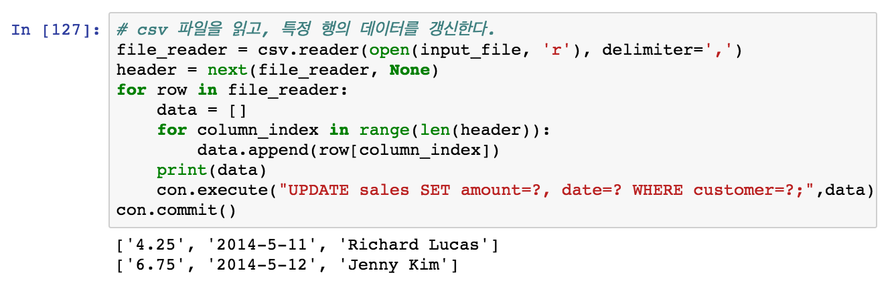

# 4. 데이터베이스

### 관계형 데이터베이스
관계형 데이터 모델에 기초한 데이터베이스

- 데이터를 행, 열로 구성된 2차원 테이블로 표현한다.
- 고유 키로 각 열을 구별한다. 
- 다른 테이블과 연결할 수 있다.

### SQL
Structured Query Language(구조화된 질의 언어)  
관계형 데이터베이스에서 데이터를 다루기 위해 사용되는 일반적인 명령어 집합이다. 

#### Create Table

```sql
CREATE TABLE table_name (
    column1 datatype,
    column2 datatype,
    column3 datatype,
   ....
);
``` 

#### SELECT

```sql
SELECT column1, column2, ...
FROM table_name;
```

```sql
SELECT *
FROM table_name;
```

#### WHERE

```sql
SELECT column1, column2, ...
FROM table_name
WHERE condition;
```

### INSERT

```sql
INSERT INTO table_name
VALUES (value1, value2, value3, ...);
```


> [SQL Tutorial](https://www.w3schools.com/sql/)

##  4.1 파이썬 내장 모듈 sqlite3

#### sqlite3  

- 인메모리(in-memory) 데이터베이스 생성을 지원하는 파이썬 내장 모듈  
- 데이터베이스를 별도로 설치하지 않고도, 파이썬 코드를 통해 가벼운 데이터베이스를 사용할 수 있다. 
- SQL 쿼리 언어로 해당 데이터베이스에 접근할 수 있다.  

> [python.org-sqlite3](https://docs.python.org/3.6/library/sqlite3.html)

#### 1. 데이터베이스 만들기


- `:memory:` 명칭을 사용해 메모리에 데이터베이스를 생성한다.   
- `sqlite3.connect()` 메서드로 사용할 db 파일에 접근한다.

> **데이터베이스를 지속시키려면 db파일명 또는 경로를 문자열을 사용한다.**
> 
> `sqlite3.connect('my_database.db')`  
> `sqlite3.connect('/Users/kay/Desktop/my_database.db')`

#### 2. 테이블 만들기


- SQL 명령어 문자열을 query라는 변수에 할당한다.
- `execute()` 메서드를 사용해 SQL 명령어를 실행시킨다.
- `commit()` 메서드를 사용해 데이터베이스의 변동사항을 저장한다.


#### 3. 데이터를 삽입하기


- 테이블에 삽입할 데이터를 정의한다. (튜플로 이루어진 리스트)
- statement에는 SQL의 INSERT 구문의 문자열을 할당한다.
- `excute()` 또는 `excutemany()` 메서드에 실행할 SQL문과 삽입할 데이터를 전달한다.
	- `excutemany()` 메서드는 복수개의 행 데이터를 한번에 처리할 수 있다.
	- statement의 `?`는 SQL 명령어에서 사용할 변수의 위치를 표시하는 역할을 한다.
	- 각 튜플의 값들이 차례대로 `?`에 대입된다. 

#### 4. 테이블에서 데이터 가져오기


- sales 테이블의 모든 데이터를 선택하는 SQL문을 실행한다.   
- 모든 데이터를 반환하는 `fetchall()` 메서드를 사용하여 rows 변수에 전체 데이터를 할당한다.

> Connection 객체에서 `execute()` 메서드를 실행하면, 내부적으로 Cursor 객체를 생성하고 해당 객체의 `excute()`를 실행한다.

### 4.1.1 테이블에 새 레코드 삽입하기


- cursor() 메서드로 Cursor 객체를 생성한다. 
- Cursor 객체의 execute() 메서드로 SQL문을 실행하여 테이블을 생성한다.
- Connection 객체의 commit() 메서드로 데이터베이스의 변경사항을 저장한다.


- csv 파일의 데이터를 한 줄씩 읽는다.
- 각 줄의 데이터를 리스트에 담고 Cursor객체의 execute()메서드로 삽입 SQL문을 실행한다.
- 모든 줄의 데이터 삽입이 끝나면 Connection 객체의 commit() 메서드로 데이터베이스의 변경사항을 저장한다.


### 4.1.2 테이블 내 레코드 갱신하기 


- 테이블 생성 및 데이터 삽입 SQL문을 실행한다.
- commit() 메서드로 데이터베이스 변경사항을 저장한다.



- csv 파일의 데이터를 한 줄씩 읽는다.
- 각 줄마다 WHERE 조건에 일치하는 데이터인 경우 갱신하는 SQL문을 실행한다.


